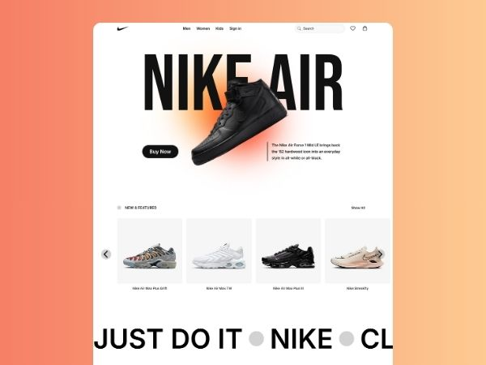

# Nike Store | Prototype Project 👟

Welcome to the Nike Store project\! This is a dynamic and responsive frontend replica of a Nike e-commerce website, complete with a functional user authentication system and a product database.

<p align="center">
<table>
<tr>
<td>

</td>
<td>

</td>
</tr>
</table>
</p>

## ✨ Features

- ✅ **Dynamic Homepage**: Features a "New & Featured" product slider that pulls data directly from the database.
- ✅ **Secure User System**: Full user registration and login functionality using PHP sessions, password hashing, and prepared statements to prevent SQL injection.
- ✅ **User Profiles**: Logged-in users can view their profile details on a dedicated page.
- ✅ **Component-Based Navbar**: A modern, reusable navbar component that dynamically shows a "Profile" link for logged-in users and "Sign in" for guests.
- ✅ **Live Search**: A functional search bar with live suggestions.
- ✅ **Responsive Design**: A clean and modern UI that adapts to all screen sizes, including a slide-out mobile navigation menu.

---

## 💻 Tech Stack

- **Frontend**: HTML5, CSS3, JavaScript
- **Backend**: PHP
- **Database**: MySQL

---

## 🚀 Getting Started

Follow these instructions to get a copy of the project up and running on your local machine.

### Prerequisites

You need a local server environment that can run PHP and MySQL. We recommend using **XAMPP**, **WAMP**, or **MAMP**.

- [Download XAMPP](https://www.apachefriends.org/index.html)

### Installation

1.  **Clone the repository** into your local server's web directory (usually `htdocs` for XAMPP).

    ```sh
    git clone https://github.com/taher-dev/nike-web-programming-project.git
    ```

2.  **Start your server**: Open your XAMPP/WAMP/MAMP control panel and start the **Apache** and **MySQL** services.

3.  **Automatic Database Setup**: This project handles database and table creation automatically\! Simply navigate to the website in your browser. The `connect.php` script will:

    - Create the `nike` database for products.
    - Create the `login` database for users.
    - Create the `shoes` and `users` tables.
    - Insert the initial shoe data into the `shoes` table.

4.  **Run the website**: Open your web browser and go to:

    ```
    http://localhost/nike-web-programming-project/
    ```

You're all set\! The website should be fully functional.

---

## 📁 File Structure

Here is an overview of the project's file structure:

```
/
├── components/
│   ├── navbar.css      # Styles for the navbar
│   └── navbar.php      # Reusable navbar component
├── img/
│   └── ...             # Product images and icons
├── connect.php         # Universal database connection & setup
├── index.php           # The homepage
├── logout.php          # Ends user session
├── profile.php         # User profile page
├── register.php        # Handles sign-up and sign-in logic
├── sign_in.php         # UI for login/registration forms
├── style.css           # Main stylesheet for pages
└── ...                 # Other PHP and JS files
```

---

## 🧑‍💻 Contributors

This project was brought to life by:

- Abdullah
- Mihad
- Monmoy
- Taher

Happy coding\! 🎉
